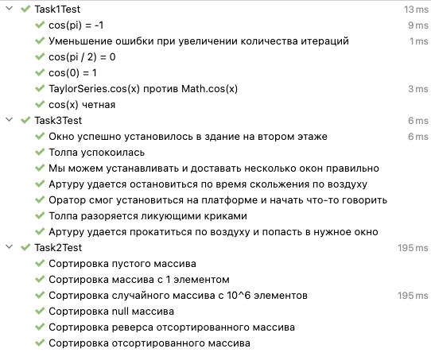

# Лабораторная работа номер 1 по дисицплине "Тестирование программного обеспечения" - Отчёт

## Информация

ФИО: Билошицкий Михаил Владимирович

Преподаватель: Ермаков Михаил Константинович

Группа: P3316

Вариант: 1672

## Задание

1. Для указанной функции провести модульное тестирование разложения функции в степенной ряд. Выбрать достаточное тестовое покрытие.
2. Провести модульное тестирование указанного алгоритма. Для этого выбрать характерные точки внутри алгоритма, и для предложенных самостоятельно наборов исходных данных записать последовательность попадания в характерные точки. Сравнить последовательность попадания с эталонной.
3. Сформировать доменную модель для заданного текста.  Разработать тестовое покрытие для данной доменной модели.

Значения:

1. Функция cos(x)
2. Программный модуль для пирамидальной сортировки массива (http://www.cs.usfca.edu/~galles/visualization/HeapSort.html)
3. Описание предметной области:

```
После того, как толпа вновь разразилась ликующими криками, Артур обнаружил, что он скользит по воздуху к одному из величественных окон во втором этаже здания, перед которым стоял помост, с которого оратор обращался к народу.
```

## Описание работы

### Задание 1

Реализованный алгоритм разложения функции cos(x) в степенной ряд: [TaylorSeries.java](./src/main/java/ru/michael/task1/TaylorSeries.java)

Сценарии тестового покрытия:

- cos(0) = 1
- cos(pi) = -1
- cos(pi / 2) = 0
- cos(x) четная
- TaylorSeries.cos(x) против Math.cos(x)
- Уменьшение ошибки при увеличении количества итераций

При количестве итераций: 30

И допустимой точности: 1e-15

Код тестов: [Task1Test.java](./src/test/java/ru/michael/task1/Task1Test.java)

### Задание 2

Реализованный алгоритм пирамидальной сортировки массива: [HeapSort.java](./src/main/java/ru/michael/task2/HeapSort.java)

Сценарии тестового покрытия:

- Сортировка случайного массива с 10^6 элементов
- Сортировка отсортированного массива
- Сортировка реверса отсортированного массива
- Сортировка пустого массива
- Сортировка массива с 1 элементом
- Сортировка null массива

Код тестов: [Task2Test.java](./src/test/java/ru/michael/task2/Task2Test.java)

### Задание 3

Реализованная доменная модель для заданной предметной области: [package](./src/main/java/ru/michael/task3)

Сценарии тестового покрытия:

- Артуру удается прокатиться по воздуху и попасть в нужное окно
- Артуру удается остановиться по время скольжения по воздуху
- Толпа разоряется ликующими криками
- Толпа успокоилась
- Окно успешно установилось в здание на втором этаже
- Мы можем устанавливать и доставать несколько окон правильно
- Оратор смог установиться на платформе и начать что-то говорить

Код тестов: [Task3Test.java](./src/test/java/ru/michael/task3/Task3Test.java)

## Результаты

```
> mvn clean test
[INFO] Tests run: 19, Failures: 0, Errors: 0, Skipped: 0
```

Intellij idea:



## Вывод

Крутая штука эти ваши тесты
