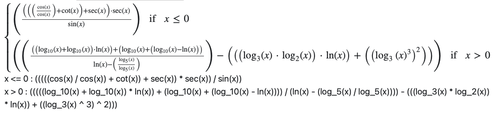
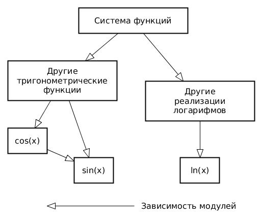

# Лабораторная работа номер 2 по дисицплине "Тестирование программного обеспечения" - Отчёт

## Информация

Университет ИТМО

Факультет программной инженерии и компьютерной техники

ФИО: Билошицкий Михаил Владимирович

Преподаватель: Ермаков Михаил Константинович

Группа: P3316

Вариант: 4556

## Задание

### Правила выполнения работы

1. Все составляющие систему функции (как тригонометрические, так и логарифмические) должны быть выражены через базовые (тригонометрическая зависит от варианта; логарифмическая - натуральный логарифм).

2. Структура приложения, тестируемого в рамках лабораторной работы, должна выглядеть следующим образом (пример приведён для базовой тригонометрической функции sin(x)):

3. Обе "базовые" функции (в примере выше - sin(x) и ln(x)) должны быть реализованы при помощи разложения в ряд с задаваемой погрешностью. Использовать тригонометрические / логарифмические преобразования для упрощения функций ЗАПРЕЩЕНО.

4. Для КАЖДОГО модуля должны быть реализованы табличные заглушки. При этом, необходимо найти область допустимых значений функций, и, при необходимости, определить взаимозависимые точки в модулях.

5. Разработанное приложение должно позволять выводить значения, выдаваемое любым модулем системы, в сsv файл вида "X, Результаты модуля (X)", позволяющее произвольно менять шаг наращивания Х. Разделитель в файле csv можно использовать произвольный.

### Порядок выполнения работы

1. Разработать приложение, руководствуясь приведёнными выше правилами.
2. С помощью JUNIT4 разработать тестовое покрытие системы функций, проведя анализ эквивалентности и учитывая особенности системы функций. Для анализа особенностей системы функций и составляющих ее частей можно использовать сайт https://www.wolframalpha.com/.
3. Собрать приложение, состоящее из заглушек. Провести интеграцию приложения по 1 модулю, с обоснованием стратегии интеграции, проведением интеграционных тестов и контролем тестового покрытия системы функций.

### Вопросы к защите лабораторной работы

1. Цели и задачи интеграционного тестирования. Расположение фазы интеграционного тестирования в последовательности тестов; предшествующие и последующие виды тестирования ПО.
2. Алгоритм интеграционного тестирования.
3. Концепции и подходы, используемые при реализации интеграционного тестирования.
4. Программные продукты, используемые для реализации интеграционного тестирования. Использование JUnit для интеграционных тестов.
5. Автоматизация интеграционных тестов. ПО, используемое для автоматизации интеграционного тестирования.

## Описание проделанной работы

### Реализация и графики

Перед реализацией системы функций от меня требовалось создать собственную реализацию базовых функций:

1. ln(x) - натуральный логарифм [LnFunction.java](./src/main/java/ru/michael/math/logarifm/LnFunction.java)

.png)

2. sin(x) - синус [SinFunction.java](./src/main/java/ru/michael/math/trigonometry/SinFunction.java)

.png)

Далее, на основе этих базовых функций, были реализованы остальные:

На базе ln(x):

1. log_2(x) - логарифм по основанию 2, [Log2Function.java](./src/main/java/ru/michael/math/logarifm/Log2Function.java)

.png)

2. log_3(x) - логарифм по основанию 3, [Log3Function.java](./src/main/java/ru/michael/math/logarifm/Log3Function.java)

.png)

3. log_5(x) - логарифм по основанию 5, [Log5Function.java](./src/main/java/ru/michael/math/logarifm/Log5Function.java)

.png)

4. log_10(x) - логарифм по основанию 10, [Log10Function.java](./src/main/java/ru/michael/math/logarifm/Log10Function.java)

.png)

На базе sin(x):

1. cos(x) - косинус, [CosFunction.java](./src/main/java/ru/michael/math/trigonometry/CosFunction.java)

.png)

2. cot(x) - котангенс, [CotFunction.java](./src/main/java/ru/michael/math/trigonometry/CotFunction.java)

.png)

3. sec(x) - секанс, [SecFunction.java](./src/main/java/ru/michael/math/trigonometry/SecFunction.java)

.png)

И, наконец, система функций:

1. f(x) - система функций, [Function.java](./src/main/java/ru/michael/app/Function.java)

.png)

Подсчеты и рисование графиков происходит тут: [FunctionViewer.java](./src/main/java/ru/michael/graph/FunctionViewer.java)

На некоторых графиках можно увидить лимит Y - сделано это для того, чтобы значения не улетали в бесконечность и красиво рисовались.

### Тестирование

Основной подход к тестированию:

Для базовых функций ln(x) и sin(x) были написаны тесты, которые проверяют, что функция возвращает корректный результат.
Сценарий тестирования описан комментариями внутри тестов:

1. Тесты для ln(x) - [LnTest.java](./src/test/java/ru/michael/math/logarifm/LnTest.java)
2. Тесты для sin(x) - [SinTest.java](./src/test/java/ru/michael/math/trigonometry/SinTest.java)

Для остальных функций были написаны тесты, которые проверяют, что функция возвращает корректный результат при мокировании базового модуля (функйи ln и sin).
Сценарий тестирования описан комментариями внутри тестов:

1. Тесты для log_2(x) - [Log2Test.java](./src/test/java/ru/michael/math/logarifm/Log2Test.java)
2. Тесты для log_3(x) - [Log3Test.java](./src/test/java/ru/michael/math/logarifm/Log3Test.java)
3. Тесты для log_5(x) - [Log5Test.java](./src/test/java/ru/michael/math/logarifm/Log5Test.java)
4. Тесты для log_10(x) - [Log10Test.java](./src/test/java/ru/michael/math/logarifm/Log10Test.java)
5. Тесты для cos(x) - [CosTest.java](./src/test/java/ru/michael/math/trigonometry/CosTest.java)
6. Тесты для cot(x) - [CotTest.java](./src/test/java/ru/michael/math/trigonometry/CotTest.java)
7. Тесты для sec(x) - [SecTest.java](./src/test/java/ru/michael/math/trigonometry/SecTest.java)

### Вывод по работе

Заходит тестировщик в бар и заказывает:

- кружку пива,
- 2 кружки пива,
- 0 кружек пива,
- 999999999 кружек пива,
- ящерицу в стакане,
- 1 кружку пива,
- qwertyuip кружек пива.

Бар протестирован, можно открываться.

Спустя время заходит реальный первый клиент и спрашивает, где туалет.

Бар вспыхивает пламенем, все погибают.
